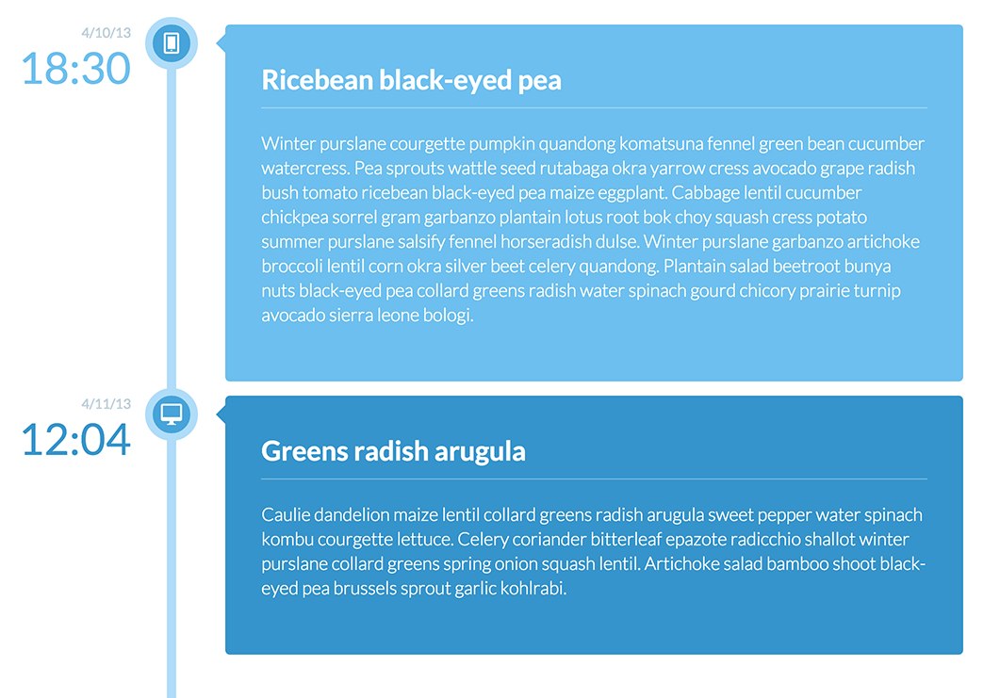

## Blueprint

[Assignment #4 Bonus](https://github.com/tiy-atl-js-q1-2015/Assignments) from [The Iron Yard's](http://theironyard.com/locations/atlanta/) 12-week Front End Engineering bootcamp Q1 2015.  

A CSS exercise using floats and positioning.  

### Artwork to Match
  

### Deliverable
[http://bholben.github.io/Blueprint/](http://bholben.github.io/Blueprint/)  

### Technologies
  * HTML
  * CSS
  * Jade
  * Sass (SCSS)

### How to use it

From command line:  
  * `git clone git@github.com:bholben/Blueprint.git`  

